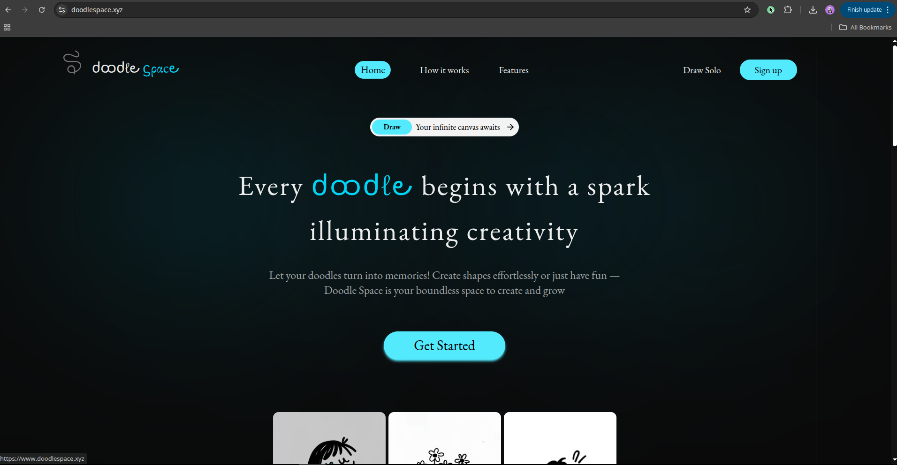
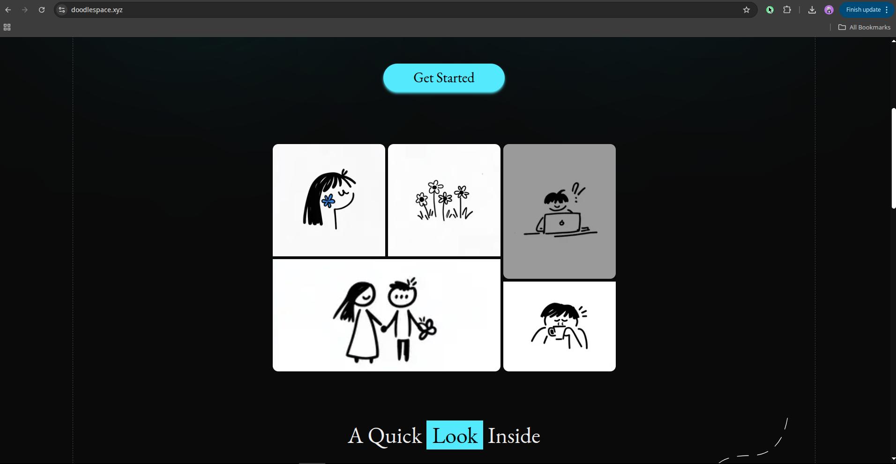
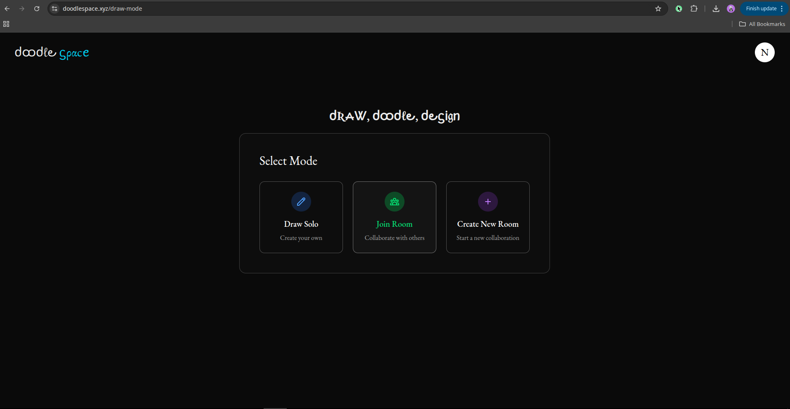

# 🎨 Doodle Space

### A blazingly fast, intuitive, and collaborative digital canvas for your ideas. Doodle Space is where creativity meets simplicity.








## ✨ Key Features
🌐 **Infinite Canvas**: Never run out of space. Pan and zoom freely to give your ideas the room they need to grow.

🤝 **Seamless Real-Time Collaboration**: Sign up for a free account, create a room, and share the link. Brainstorm with your team, classmates, or friends in perfect sync.

✏️ **Complete Drawing Toolkit**: Go from concept to creation with essential tools: Pencil, Eraser, Selection, Pan, and Shapes (Rectangle, Circle, Diamond, Line, Arrow).

👆 **Total Control Over Elements**: Easily select, move, and resize any object on the canvas. Multi-level undo and redo are always at your fingertips.

🚪 **Flexible Rooms**: Create dedicated, private rooms for your projects. You can work solo or invite others to join your session.

🚀 **Built for Speed**: No lag, no friction. Just a smooth, responsive drawing experience that lets you focus on what matters.


## 🛠️ Tech Stack
Doodle Space is built with a modern, scalable, and efficient technology stack to ensure the best performance and user experience.

- Next.js 
- Rough.js 
- Turborepo 
- Prisma 
- Websockets 
- Express.js 
- Typescript 
- Zustand


## 🚀 Getting Started
Ready to run Doodle Space locally? Follow these simple steps.

### Prerequisites
Ensure you have Node.js (v18 or later) and pnpm installed on your machine.

#### Installation
Clone the Repository

```git clone https://github.com/yuvrajnode/doodle-space.git```

#### Navigate to the Directory

```cd doodle-space```

#### Install Dependencies

```pnpm install```

#### Run the Development Server

```pnpm run dev```

#### Open http://localhost:3002 in your browser to see the result.

## 🙌 Contributing
Contributions are what make the open-source community such an amazing place to learn, inspire, and create. Any contributions you make are greatly appreciated.

- Fork the Project

- Create your Feature Branch (git checkout -b feature/AmazingFeature)

- Commit your Changes (git commit -m 'Add some AmazingFeature')

- Push to the Branch (git push origin feature/AmazingFeature)

- Open a Pull Request
