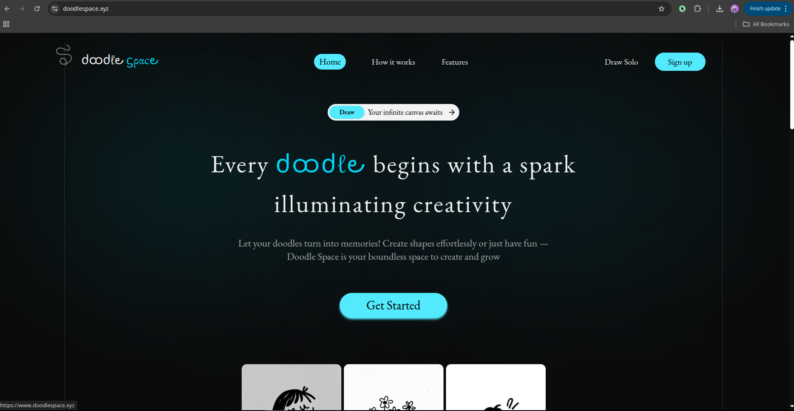
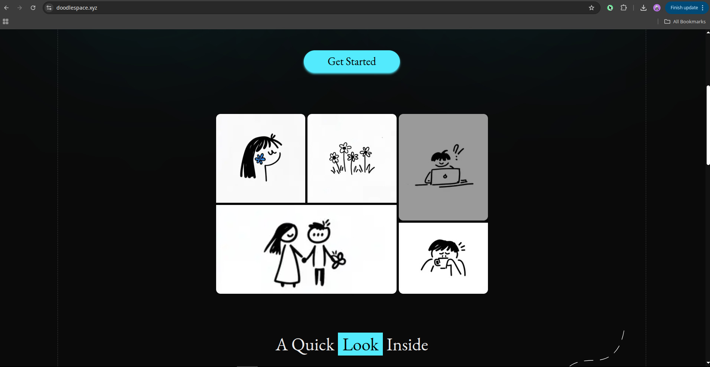
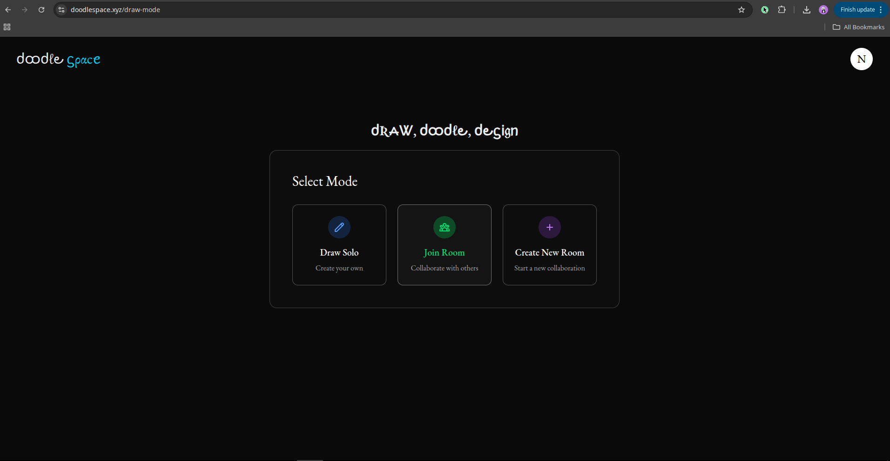

# 🎨 Doodle Space

### A blazingly fast, intuitive, and collaborative digital canvas for your ideas. Doodle Space is where creativity meets simplicity.







## ✨ Key Features

Doodle Space offers a rich set of features designed to enhance collaboration and creativity:

- **🌐 Infinite Canvas**: Experience boundless creativity with an infinite canvas that allows you to pan and zoom freely, ensuring your ideas have ample space to grow and evolve.

- **🤝 Seamless Real-Time Collaboration**: Sign up for a free account, create a dedicated room, and effortlessly share the link with your team, classmates, or friends. Brainstorm and work together in perfect synchronization, no matter where you are.

- **✏️ Complete Drawing Toolkit**: From initial concepts to refined creations, Doodle Space provides a comprehensive suite of essential drawing tools, including Pencil, Eraser, Selection, Pan, and various Shapes (Rectangle, Circle, Diamond, Line, Arrow).

- **👆 Total Control Over Elements**: Enjoy precise control over every element on your canvas. Easily select, move, and resize any object, with the added convenience of multi-level undo and redo functionality always at your fingertips.

- **🚪 Flexible Rooms**: Create dedicated, private rooms for each of your projects. Whether you prefer to work solo or invite others to join your session, Doodle Space adapts to your collaborative needs.

- **🚀 Built for Speed**: Designed for optimal performance, Doodle Space delivers a smooth, responsive drawing experience with virtually no lag or friction, allowing you to focus entirely on your creative process.

## 🛠️ Tech Stack

Doodle Space is built with a modern, scalable, and efficient technology stack to ensure the best performance and user experience:

| Category         | Technologies                                     | Description                                                                 |
| :--------------- | :----------------------------------------------- | :-------------------------------------------------------------------------- |
| **Frontend**     | Next.js, Rough.js, Zustand                       | Dynamic UI, hand-drawn style graphics, and state management                 |
| **Monorepo**     | Turborepo                                        | Efficient management of multiple packages within a single repository        |
| **Database**     | Prisma                                           | Next-generation ORM for seamless database access and management             |
| **Real-Time**    | WebSockets                                       | Enables real-time communication for collaborative features                  |
| **Backend**      | Express.js                                       | Robust and flexible web application framework for API services              |
| **Language**     | TypeScript                                       | Provides type safety and enhances code quality and maintainability          |

## 🚀 Getting Started

Ready to run Doodle Space locally? Follow these simple steps to set up your development environment:

### Prerequisites

Ensure you have the following installed on your machine:
- **Node.js** (v18 or later)
- **pnpm** (for package management)

### Installation

1. **Clone the Repository**:
   ```bash
   git clone https://github.com/yuvrajnode/doodle-space.git
   ```

2. **Navigate to the Directory**:
   ```bash
   cd doodle-space
   ```

3. **Install Dependencies**:
   ```bash
   pnpm install
   ```

4. **Run the Development Server**:
   ```bash
   pnpm run dev
   ```

Once the server is running, open `http://localhost:3002` in your browser to access the application.

## 🙌 Contributing

Contributions are highly valued and greatly appreciated! They are what make the open-source community such an amazing place to learn, inspire, and create. If you'd like to contribute, please follow these steps:

1. **Fork the Project**
2. **Create your Feature Branch**: `git checkout -b feature/AmazingFeature`
3. **Commit your Changes**: `git commit -m 'Add some AmazingFeature'`
4. **Push to the Branch**: `git push origin feature/AmazingFeature`
5. **Open a Pull Request**
